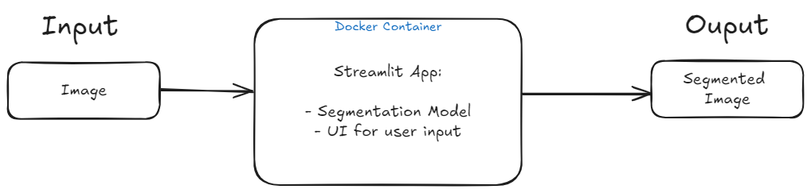

# App architecture

## Version 1
This version will include a simple Streamlit app that takes the image as input from the user. Then displays the Segmented Image.

### Planned architecture diagram

# Brain Tumor Segmentation

## Overview

This repository contains code for brain tumor segmentation using both machine learning and deep learning approaches. The primary objective of this project is to accurately segment brain tumors from medical images.

## Approaches

- **Machine Learning Approach**:
  Utilizes traditional machine learning techniques for tumor segmentation.

- **Deep Learning Approach**:
  Implements advanced deep learning models for improved segmentation.
  - **Note**: The deep learning model has not yet converged due to limited computational resources. Fine-tuning of the `DeepLab` model is currently in progress to enhance performance.
  - -------------------------------------------------------------------------------------------------------------------------------------------------------------------------------------------------------

## Update for Issue #4: Segmentation App Development

### Overview

A Streamlit app has been created and dockerized to handle the segmentation of 2D MRI Slice Images. The app takes a 2D MRI Slice Image as input and returns a segmented image, highlighting the pixels of interest (tumor regions).

### Model Details

- **Model Used**: Random Forest Classifier
- **Input**: 2D MRI image
- **Output**: The output is a segmented image where:
  - **Foreground (Tumor)**: Pixels representing the tumor are highlighted in white (intensity = 255) and labeled as `1`.
  - **Background**: All other pixels are set to black (intensity = 0) and labeled as `0`.

### Preprocessing

Each pixel of the MRI image is convolved with different kernels (filters) to extract meaningful information. The resulting values are stored in a DataFrame for processing. The following filters are used:

- **Gabor Filter**: Applied with different parameters to capture texture information.
- **Median Filter**: Used to reduce noise while preserving edges.
- **Gaussian Filter**: Applied to smooth the image and reduce noise.
- **Sobel Filter**: Used to detect edges by calculating the gradient of the image intensity.
- **Canny Filter**: A multi-stage algorithm used for edge detection.
- **Prewitt Filter**: A simple edge detection filter that calculates the gradient of the image intensity.
- **Scharr Filter**: Similar to the Sobel filter but provides a more accurate edge detection by using a different convolution kernel.

### Training Process

The model is trained using annotated labeled data (ground truth), which provides clear distinctions between the tumor (foreground) and non-tumor (background) areas. The binary classification approach enables the model to effectively differentiate between the two classes based on pixel intensity.

### Usage

- The app is built using Streamlit, providing an interactive user interface.

